# Capstone Project: Heart Failure Prediction

## Overview
This project is part of Udacity Azure Machine Learning Nanodegree capstone requirement. In this Project, we build Azure Machine Learning model using AutoML and HyperDrive, then deploy the best performing model.  The model is deployed to Azure Container Service using Azure ML Python SDK.

In Azure Machine Learning Studio, an AutoML run is configured for the given dataset. The AutoML Run identifies the best model using a defined metric such as accuracy or AUC ..etc. The best model is then deployed to Azure Container Instances(ACI) or Azure Kubernetes Instances(AKI). The deployment creates an endpoint, and the endpoint can be managed using Python SDK. The model can invoked using the endpoint. Also, using the model reference, we can predict the heart failure using a test dataset.

The following diagram shows the steps involved in training models using hyperdrive and AutoML and deploying the best performing model.
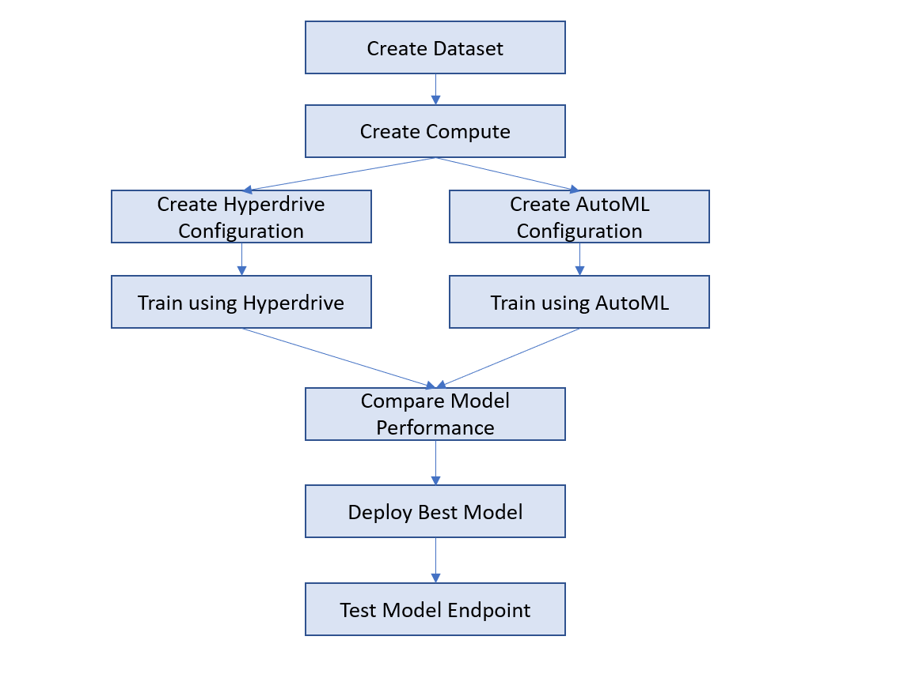

## Project Set Up and Installation
The notebooks contain all the code required to load the dataset, configure the compute instance, the AutoML model and deply the best model.
The environment details are saved to repository.

## Dataset

### Overview
Cardiovascular diseases (CVDs) are the number 1 cause of death globally, taking an estimated 17.9 million lives each year, which accounts for 31% of all deaths worlwide.Heart failure is a common event caused by CVDs and this dataset contains 12 features that can be used to predict mortality by heart failure. Most cardiovascular diseases can be prevented by addressing behavioural risk factors such as tobacco use, unhealthy diet and obesity, physical inactivity and harmful use of alcohol using population-wide strategies.

People with cardiovascular disease or who are at high cardiovascular risk (due to the presence of one or more risk factors such as hypertension, diabetes, hyperlipidaemia or already established disease) need early detection and management wherein a machine learning model can be of great help.

This Heart Failure Prediction dataset is downloaded from Kaggle. Death due to Heart Failure is predicted using information usch as anaemia, diabetes, high blood pressure, platelets, serum_creatinine, serum_sodium, creatinine_phosporous and ejection_fraction(%bllod leaving the heart at each contraction).

### Task
Predict the "DEATH_EVENT" column based on the input features, either the person survives (DEATH_EVENT=0) or cannot survive(DEATH_EVENT=1). The machine learning task is to run classification based on the input features. In HyperDrive experiment, we use Logistic Regression and identify best parameters. Using AutoML, we identify best algorithm. We have AUC metric to determine best model.

### Access
I have downloaded the CSV file from Kaggle and uploaded into my repository. Everytime notebook runs, it checks if the data available in the workspace and uploads the file to datastore if the data doesn't exist in the workspace.

## Automated ML
Azure Maching Learning support automatic training and comparison of maching learning models using AutoML. To Run AutoML, an AutoMLConfig object needs to be created with paramteres such as dataset, training cluster, machine learning task, target column and metric to evaluate the algorithm. In this project, we used the following AutoML settings.
- experiment_timeout_hours: The time limit in hours for the experiement. In this experiment, I have used 2 hours
- max_concurrent_iterations: maximum number of iterations that will be executed in parallel. In this experiment, i have used 10.
- primary_metric: Metric to be used to optimize for model selection. the best-run model will be choosen based on this metric. Accuracy is common metric for classification problems. In this experiment, i have used AUC_Weighted as the primary metric.
- enable_early_stopping: enable early termination if the score is not improving in the short term
- featurization: Indicator for whether featurization step should be done automatically or not, or whether customized featurization should be used. In this project, I have used 'auto'
The following code snippet shows the parameters of the automl configutation.
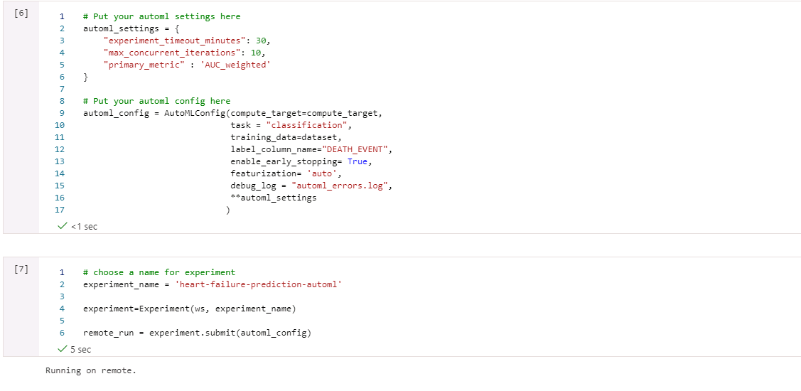 

The AutoMLconfig object is then submitted to an experiment, which runs AutoML on the specified data. The following picture shows the run settings of the AutoML run.
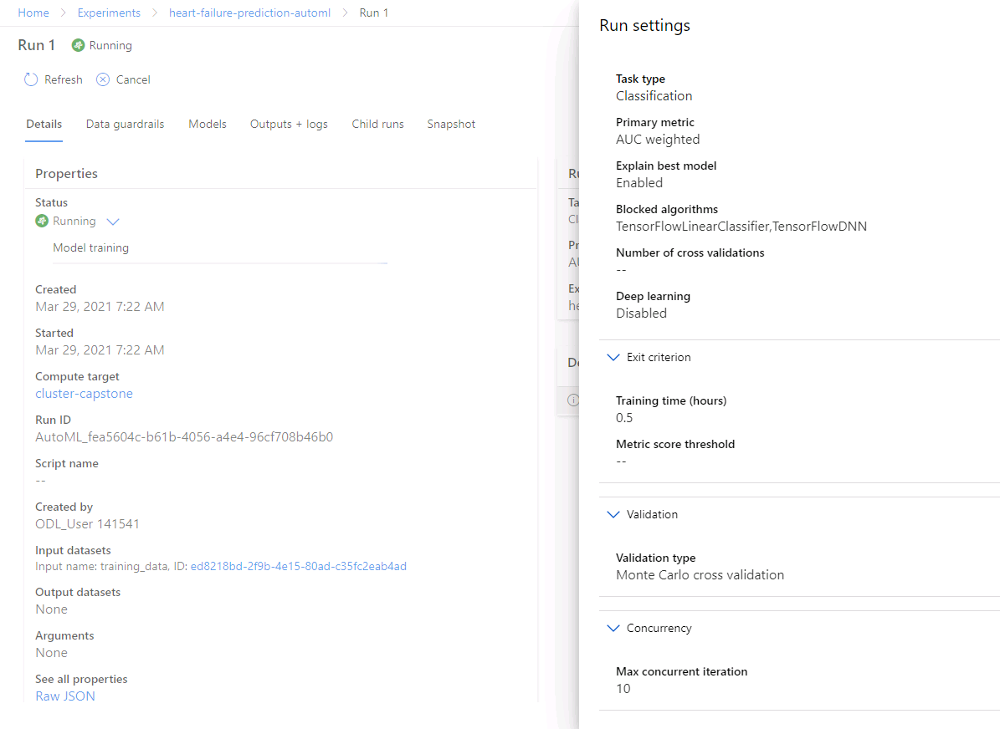

The following screenshot shows RunDetails of AutoML.
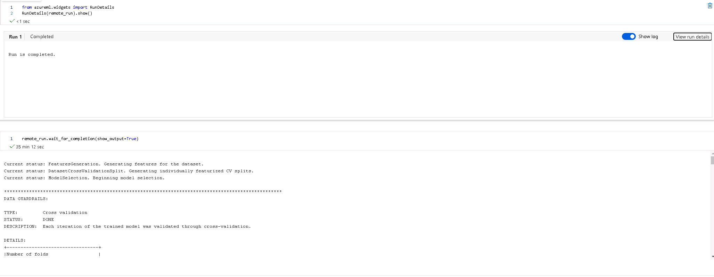

AutoML preprocessed the data, trains different models and ranks the models based on user selected metric. The following picture shows top algorithms that autoML ran and ranked the runs based on the metric. In this experiment, AutoML identified VotingEnsemble. The following picture shows the run settings of voting ensemble algorithm.
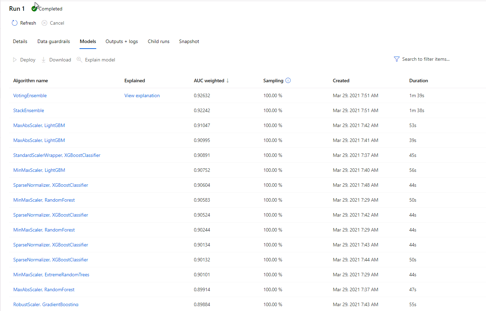

A voting ensemble is an ensemble machine learning model that combines the predictions from multiple other models. The following picture shows metrics generated by voting ensemble.
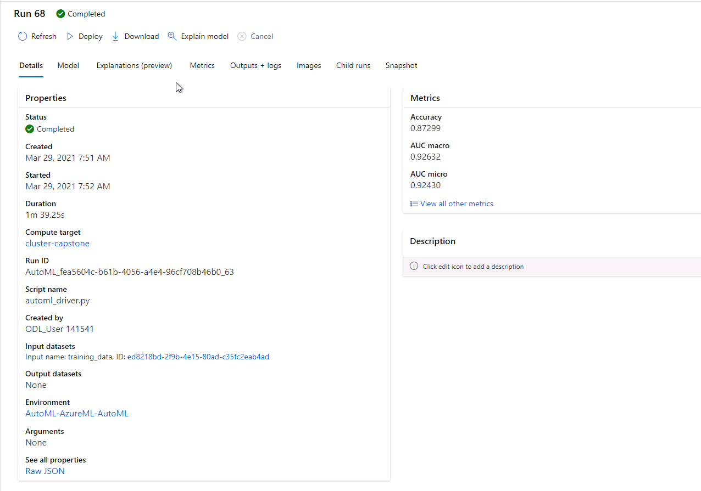

In this experiment, AutoML identified VotingEnsemble. The following picture shows the properties of voting ensemble algorithm. In this case, VotingEnsemble used other algorithms and combined the output using weights. The ensembled algorithms are RandomForest, XGBoostClassifier, GradientBoosting, XGBoostClassifier, XGBoostClassifier, RandomForest, XGBoostClassifier, RandomForest and ExtremeRandomTrees. Some of these algorithms are repreated with different hyper paramters.
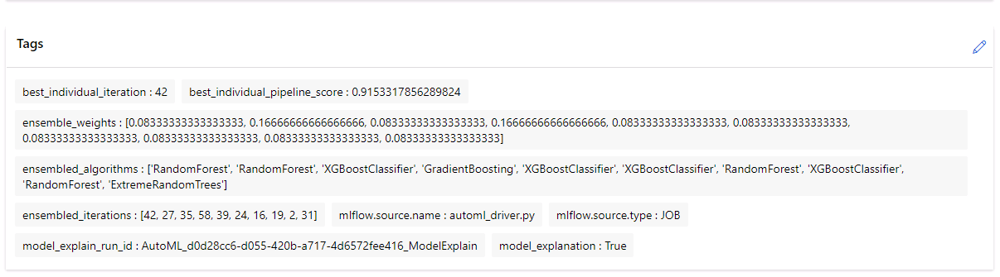

The AutoML fitted model can be obtained using the get_output() method of the AutoML run object. The fitted model describes the steps used in the model, the data transformations applied and the hyperparameters used in the model. In this experiment, AutoML used votingclassifier with accuracy of 0.8729 and AUC of 0.9263. The following screenshot shows fitted model properties.
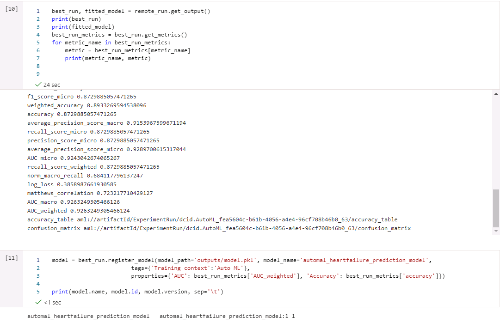

## Hyperparameter Tuning
AzureML supports hyperparameter tunig using hyperdrive package. Using hyperdrive, the parameter search space space can be defined using randon, grid or bayesian sampling. In the experiement, LogisticRegression classification was used. The training script loads the data, cleans that data, and runs LogisticRegression using the parameters supplied to the script and logs the metrics. The hyperdrive samples the paramters and calls the training script using a set of parameters at a time. Hyperdrive compares the metrics, and ranks the experiment runs based the specific metric. In this experiment, Accuracy was used to rank the runs.

In this experiment, RandomSampling was used to sample max_iter and C paramters. max_iter is the maximum number of iterations for the learning algorith to converge. In thix experiment, I have used discrete list values [500, 1000, 5000] for max_iter. C is the inverse of regularization strength. In this experiment, i have used discrete list values [100, 10, 5, 2, 1, 0.1, 0.01, 0.001] for C. The Random Sampling selects combination max_iter and C. Random Sampling supports early termination of low-performance runs. The high level steps in hyperdrive pipeline are shown in the following diagram
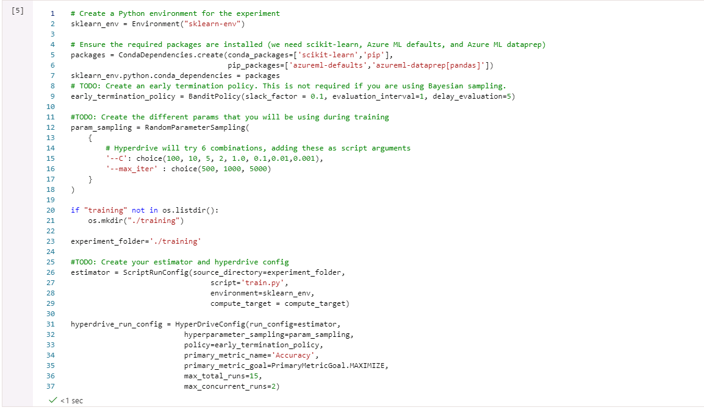

The following screenshot shows the RunDetails of the Hyperdrive experiement.
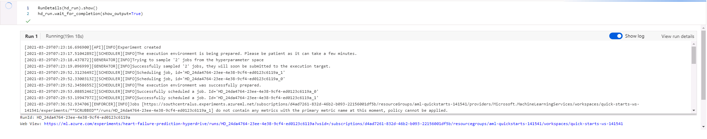

The hyperdrive support early termination using a policy, which improves the performance. In this experiement, BanditPolicy was used to terminate runs where the primary metric is not within the specified slack factor/slack amount compared to best performing run.
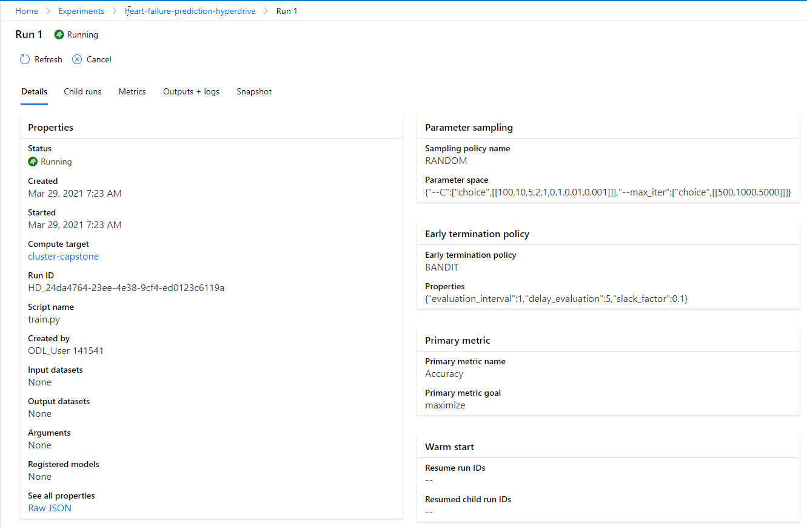

The following picture shows the results of hyperdrive experiment, shows the runs with hyperparameters and results. The best performing model uses a value of 1 for C and 1000 for max_iter
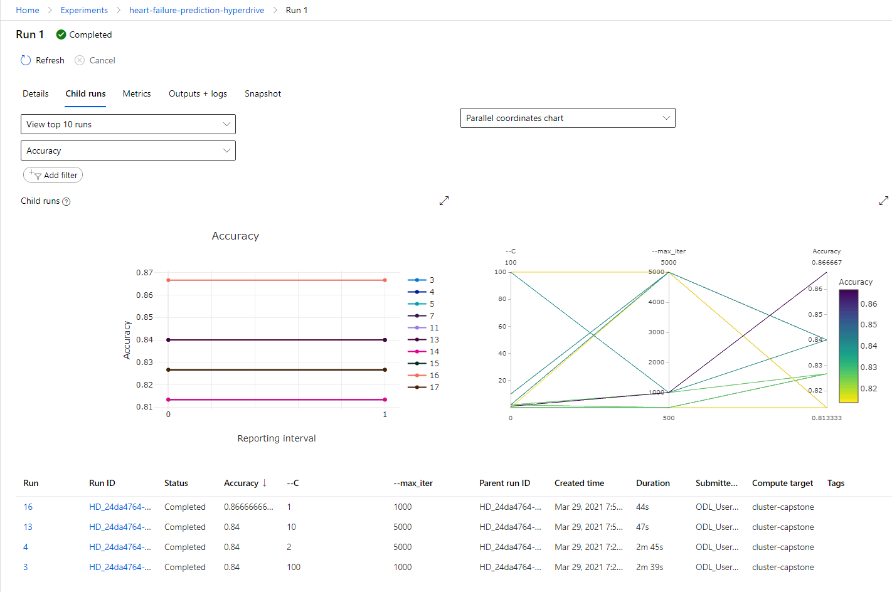

The following picture shows details of best run from the hyperdrive experiment. It shows the parameters it used(Max iterations:1000, REgularization strength:1) and metrics(AUC:0.879 and Accuracy:0.867)
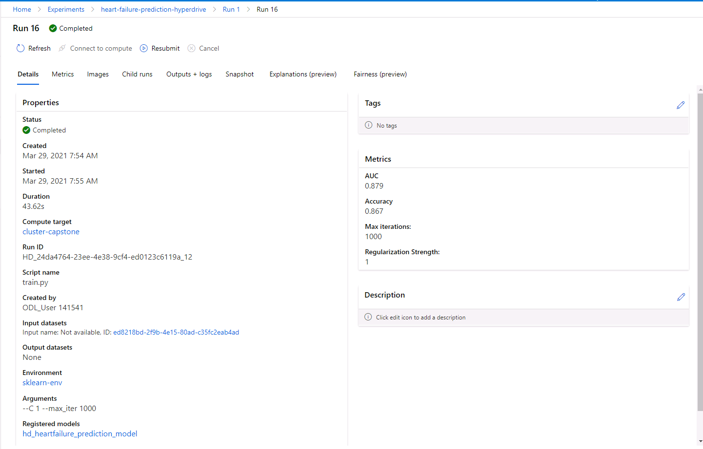

The following screenshot shows the parameters generated from the sampling and child runs in the hyperdrive experiement.
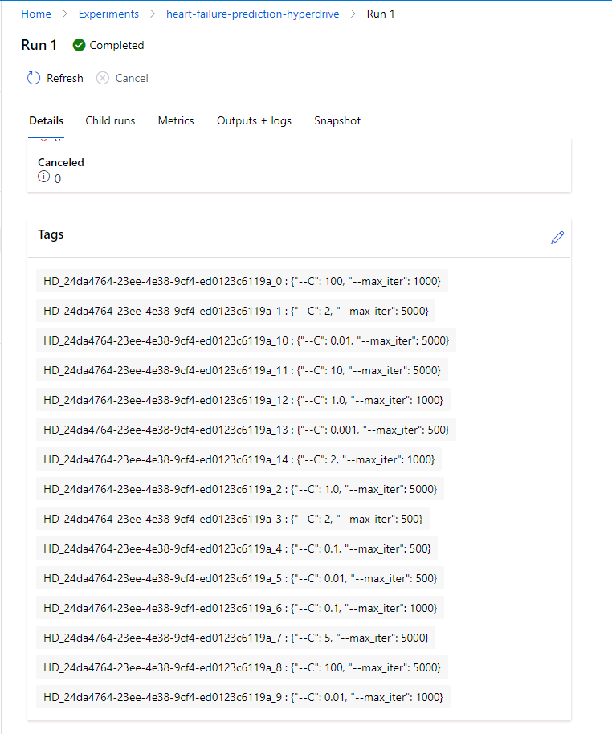

The best run model provides an accuracy of 0.8666 and AUC of 0.8792. the following picture shows the metrics of the best performing model
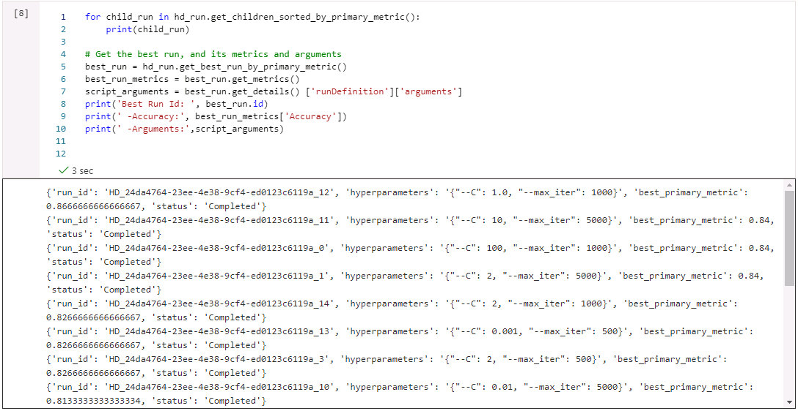 

Using Python SDK, we can register the best model with AzureML workspace and tag the model with metrics. When we are running the experiment multiple times, this information can be used to compare results from different runs.
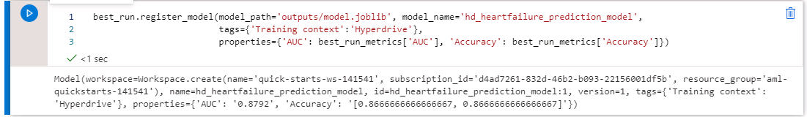 

## Model Deployment
Automate ML model gives better result so we deployed the best run of AutoML. Using Python SDK, the model can be deplyed to Azure Container Service.
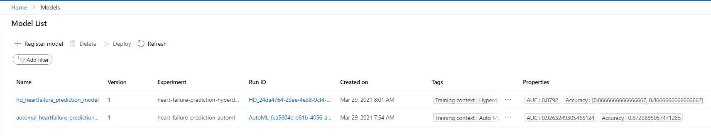

### Code
An InferenceConfig is created with a scoring script. The scoring script can be downloaded from the model outputs of the best performing AutoML run. Deployment Configuration speficies information about cores and memory to be used by the deployment. The model can be deployed by passing inference configuration and deployment configuration to model's deploy method. Once the model is deployed, scoring URI can be obtained from the service.
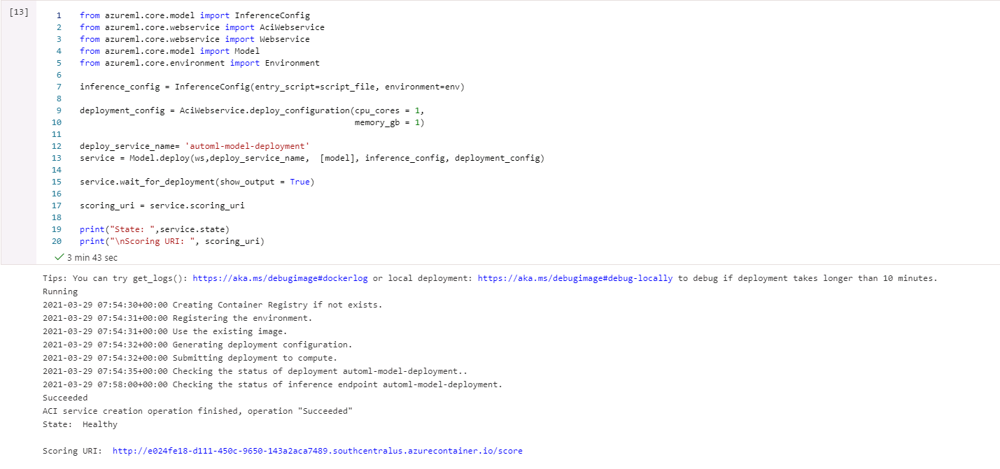

### Deployed Model and Endpoint
The Web Interface shows the deployed model and endpoint associated with the deployed model.
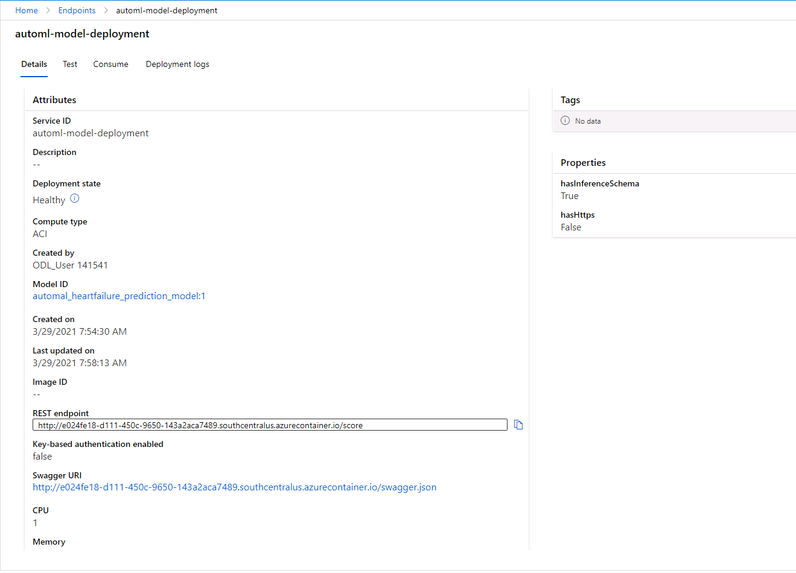

### Scoring
The Scoring endpoint is a REST web service. We can post the data to the web service and obtain the prediction result.
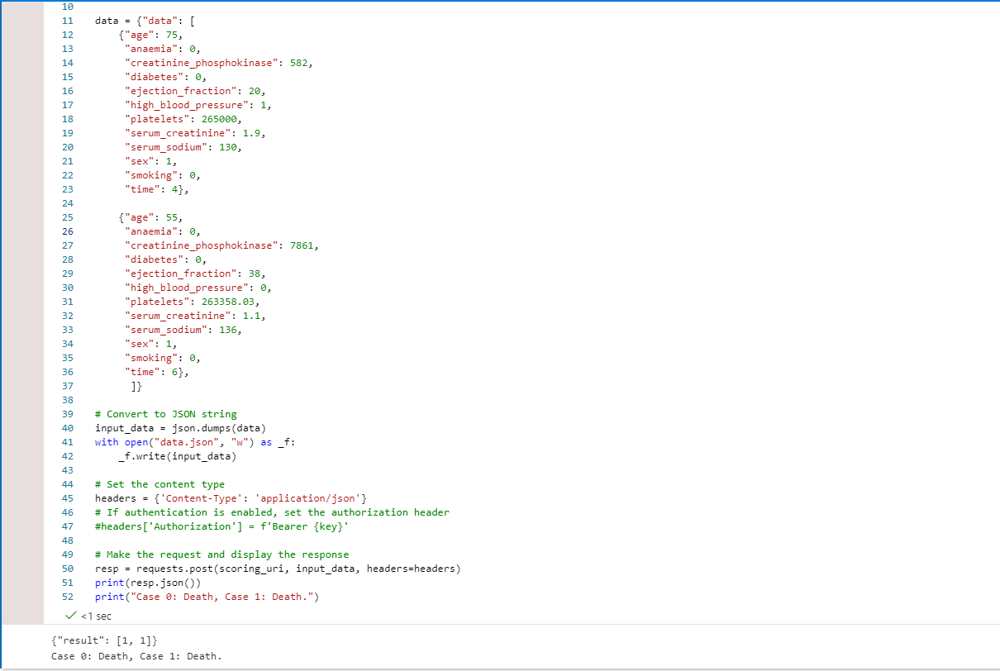

### Testing deployed model
Also, the endpoint can be invoked directly using the run method of the endpoint.
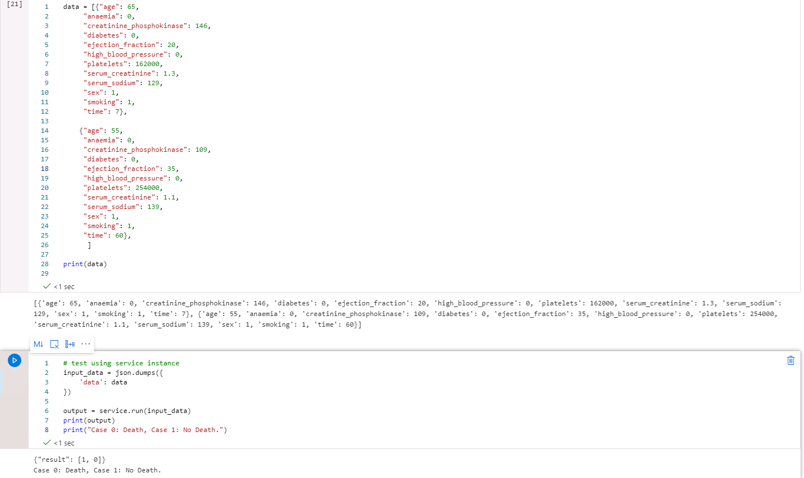

## Screen Recording
[Screencast](https://drive.google.com/file/d/139ZTAHwf8yCcA2cDQbrlLMLowJeyuCQM/view?usp=sharing)

## Future Work
### HyperDrive
- Use Different Sampling method
- Use other classification algorithms such as decision trees, svm classifier
### AutoML
- Use different primary metric for classification
- Analyze the data and use feature engineering techniques such as PCA to reduce the dimentionality of the data.